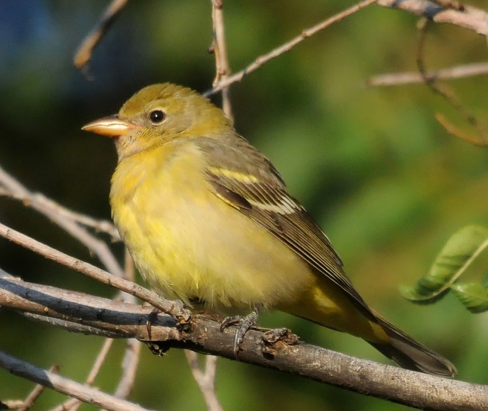
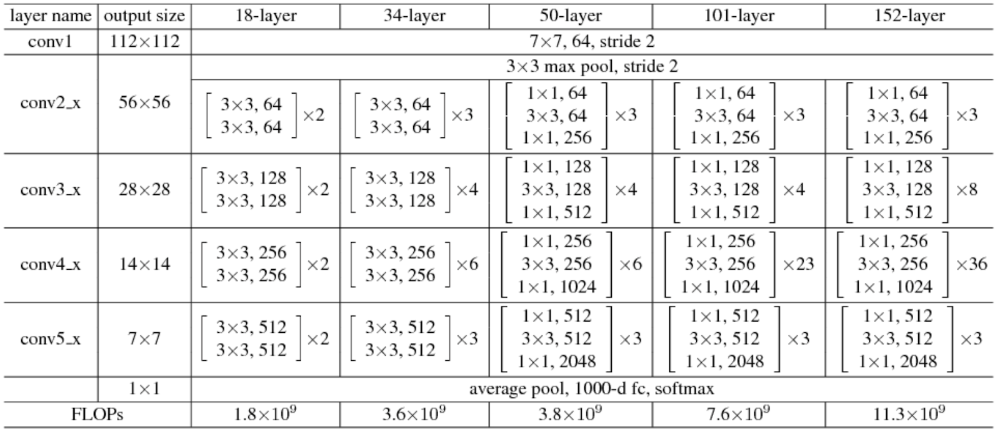
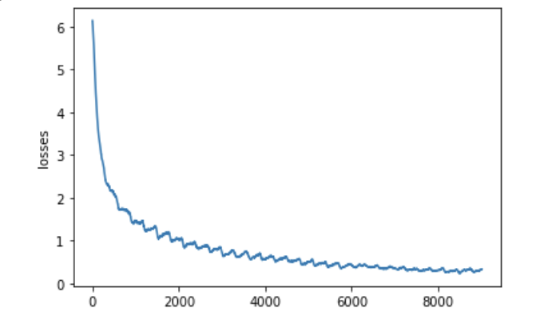
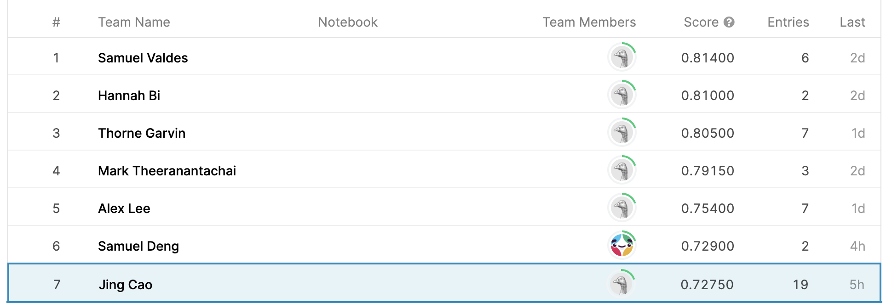

## Bird Classification
  

### Problem description
We were doing image recognition of vehicles and using the data from Kaggle and Cifar. This recognition includes convolutional neural networks in pytorch. However, once the professor announced the bird classification challenge, we understood that we can use the same skill for classifying different types of birds. We can use a neural network to train the bird dataset with up to 38562 images in it and see how accurate our model is. In addition to our accuracy, we also can compete with others training accuracy in Kaggle. This can help us to think about how to improve our model, including changing the number of epochs or the size of learning rate.  
  
Here is the link of our Github Repo: [Github website](https://github.com/JingC123/CSE455_Project)

### Related work

**ResNet**: PyTorch's ResNet model was used to be our pretrained model. Resnet models were proposed in “Deep Residual Learning for Image Recognition”. There are several versions of resnet models which contain different layers respectively. In the kaggle competition, “resnet18”(vision:v0.6.0) which contains 18 layers, was used as an example of the pretrained model. Detailed model architectures and accuracy can be found online. We tested different versions of resnet pretrained model to get the best accuracy result for the competition problem. 
  

**Dataset**: We are using the kaggle bird identification dataset provided by the instructor
There are 555 different images categories (birds) given by integers [0-554].
Here is the link: [https://www.kaggle.com/c/birds21wi](https://www.kaggle.com/c/birds21wi)

### Methodology

**Platform and tool**:
We decide to use colab as our developing platform since it is more convenient for a team project. Colab also provides online GPUs computation from Google. We can use those GPUs with cuda computation for training models and accelerating computational speed. In addition to the online platform, the programming tool we used in this project is Pytorch. Pytorch supports several computational functions in the neural network. We can design our own neural network and train the model in Pytorch. It also supports cuda computation in GPU. We can use the GPU in colab with Pytorch to train the model and accelerate computation speed. 
  
**Data preprocessing**:

After having a preliminary check on the dataset, we found that the dataset is large, and downloading it every time from the internet will take a lot of time, while the training time is also affected. Thus, we preprocessed the images, including downsizing the image, convert the JPG file into an H5 file, and load all the images into RAM in the beginning, before training.

* #### Downsizing the image and convert file:

The dataset comes with various sizes of images which makes the dataloader needs to resize the image every time.  To deal with this problem, we decided to resize the images locally before uploading them to collab. By doing this the dataloader does not have to adjust the image size every time an image is loaded. Also, as suggested by the instructor, using the H5 format will be faster than JPG, thus, we convert the JPG file to H5 using NumPy and h5py. After these two processes, the new files are uploaded and used as the training data. The code can be found at[https://github.com/JingC123/CSE455_Project/blob/main/code/Preprocess.py](https://github.com/JingC123/CSE455_Project/blob/main/code/Preprocess.py).

* #### Loading Data into RAM:

After preprocessing the data, the total size of data is about 9GB, although it is still large, it is still smaller than the size of RAM provided by Google Colab. Thus, instead of only loading the image from the disk when we are using that image, we decide to load all images to RAM at one so when the dataloader needs the image, it can access it faster. To implement it, we wrote a custom class, BirdDataSet, that loads images and labels in a dictionary when it is created. By doing this, we manage to decrease the running time from 4 hours to 30 minutes. The BirdDataSet class can be found at [https://github.com/JingC123/CSE455_Project/blob/main/code/BirdDataSet.py](https://github.com/JingC123/CSE455_Project/blob/main/code/BirdDataSet.py).

**Overfitting**:
  

We use the pretrained Resnet50 net as our model. In the first 10 epochs, the performance of the net is very good. The training and testing accuracy we got are 0.73, 0.58.  
  
But unfortunately, when we trained the model to 20 epochs, we encountered a very serious overfitting problem. The training accuracy we got is 0.98, but the testing accuracy we got is only 0.72. And when we kept training this model, the situation was not going well -the testing accuracy almost did not increase at all.
  
We have adopted the following methods to solve this problem.
* #### Add decay
As we know, we can add decay to prevent overfitting. The default decay is 0.0005. We set the decay to 0.005. But the improvement effect is minimal. The testing accuracy rose from 0.72 to 0.73.
* #### Add dropout layer
We try to add a dropout layer after the convolutional layer to prevent overfitting. But it doesn’t work, even letting the losses decrease slowly. So we decide to delete the dropout layer.
* #### Use another pretrianed net
We try to use another pretrained net, for example, Resnet152. But the Resnet152 doesn’t work well. We guess that because Resnet152 is more complex and deeper, so it is more easily overfitted.

### Results
We have tried many types of training combinations, but most of them don't work well. We haven’t fixed the problem of overfitting.  
The training plan we used in the end is:  
Resnet50 pretrained model with total 35 epochs.  
1. In the first 20 epochs, we set the lr = 0.01 and decay =0.0005. And we got the losses = 0.436, training accuracy = 0.875.
2. The next 10 epochs, we set the lr=0.001.
3. In the final 5 epochs, we set the decay = 0.005.
  

Therefore, we got the final result. The final losses = 0.11 and the training accuracy = 0.98.
  

In the end, the score we got is 0.7275. That's a sad story, we are 7th in the competition :(

### Expectation
I think the score we got is not very high, there still have huge space to improve. So maybe we can try some other pretrained models or improve the predict method to get a better test result.

